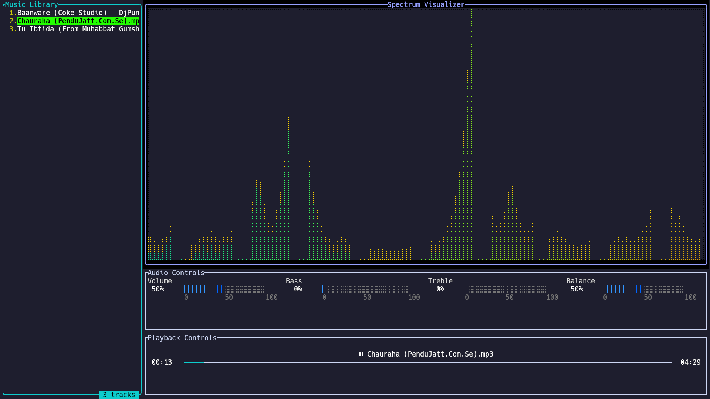

# MeloviTUI 🎵
MeloviTUI is a terminal-based music player and audio visualizer built in Rust. It features a beautiful spectrum analyzer, playback controls, and an intuitive terminal user interface.


## ✨ Features
- 🎵 Music Library Management
  - Simple directory-based music browsing
  - Supports multiple audio formats via Symphonia
  - Reads music from a configured directory path
  > **Note**: Currently, playlist management is not implemented. The player reads music files directly from a specified directory that you set in the config file or pass as an argument.
- 🌈 Real-time Audio Visualization
  - Dynamic spectrum analyzer with multiple visualization modes
  - Smooth animations and color transitions
  - Responsive to audio frequencies
- 🎚️ Audio Controls
  - Volume control
  - Track navigation
  - Real-time audio processing
- ⏯️ Playback Controls
  - Play/Pause/Stop functionality
  - Track progress bar
  - Current track information display
  - Duration and time elapsed indicators

## 🚀 Installation
### Prerequisites
- Rust toolchain (1.75.0 or later)
- System audio dependencies:
  - Linux: ALSA development files
  - macOS: No additional dependencies
  - Windows: No additional dependencies

### Building from Source
1. Clone the repository:
```bash
git clone https://github.com/yourusername/melovitui.git
cd melovitui
```
2. Build and run:
```bash
cargo build --release
```

### Configuration
Before running the application, you need to specify your music directory. You can do this in two ways:

1. Pass the directory as a command-line argument:
```bash
cargo run --release -- --music-dir "/path/to/your/music"
```

2. Or set it in the config file (config.toml):
```toml
music_dir = "/path/to/your/music"
```

## 🎮 Usage
### Keyboard Controls
- **Navigation**
  - `j`: Move down in music library
  - `k`: Move up in music library
  - `Enter`: Play selected track
- **Playback**
  - `p`: Toggle Play/Pause
  - `s`: Stop
- **Volume Control**
  - `←`/`→`: Adjust volume
- **Application**
  - `q`: Quit

> **Note**: Advanced audio processing features (bass, treble, and balance adjustment) are currently in development. These features require additional implementation using the DASP (Digital Audio Signal Processing) library. While the key bindings exist in the code (`Shift + ←/→` for balance, `Shift + ↑/↓` for treble, and `↑/↓` for bass), they are not currently functional.

## 🛠️ Technical Architecture
MeloviTUI is built with a modular architecture:
```
src/
├── main.rs           # Application entry point
├── app.rs            # Core application state
├── audio_system.rs   # Audio processing and playback
├── controls/         # Input handling and state management
├── logger.rs         # Logging system
└── ui/              # User interface components
```

### Core Dependencies
- `ratatui`: Terminal user interface framework
- `rodio`: Audio playback
- `symphonia`: Audio decoding
- `rustfft`: Fast Fourier Transform for spectrum analysis
- `log4rs`: Logging system

## 📝 Logging
Logs are stored in the `logs/` directory:
- `app.log`: Current session log
- `app.{0-2}.log`: Rotated log files

## 📜 License
This project is licensed under the MIT License - see the [LICENSE](LICENSE) file for details.

## 🙏 Acknowledgments
- [Ratatui](https://github.com/ratatui-org/ratatui) for the amazing terminal UI framework
- [Rodio](https://github.com/RustAudio/rodio) for audio playback capabilities
- [Symphonia](https://github.com/pdeljanov/Symphonia) for robust audio decoding


## 📦 Release Process
### For Developers
To create a new release:

1. Update version in `Cargo.toml`:
```toml
[package]
version = "x.y.z"  # Update this version number
```

2. Create and push a new tag:
```bash
# Create a new tag
git tag -a v1.0.0 -m "Release version 1.0.0"

# Push the tag
git push origin v1.0.0
```

3. The GitHub Actions workflow will automatically:
   - Create a new GitHub Release
   - Build binaries for Windows, macOS, and Linux
   - Generate SHA-256 checksums
   - Attach all files to the release

---
Built with ❤️ using Rust
